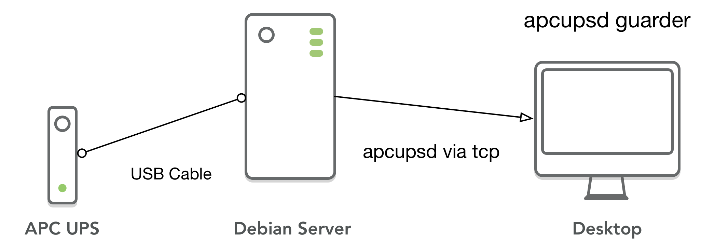

# apcupsd guarder

## 检测 APC UPS 守护进程并执行对应的脚本



开发机（macOS 平台）和部署机器（Debian）在同根 UPS 电缆上，但是 macOS 平台的第三方 apcupsd 和系统的电源管理有冲突，所以将 UPS 通过 USB 数据线交付部署机管理。

但这样子 macOS 就无法获得 UPS 的信号，极端情况下可能外部电源失效，部署机正常关机了但 macOS 还会非法关机。

于是就有了这个小的 golang 小程序，用于监控指定 apcupsd 的机器监控并执行对应的脚本（例如关机等）。

## 编译和安装

建议使用 golang1.13 以上进行编译，golang 安装好了以后简单的使用 `make install` 即可完成编译。

在 Mac 环境下，建议讲可执行文件放在 `/usr/local/bin` 目录中（或者任何你可以执行到 $PATH 的地方，但需要更改 `apcupsd_guarder.plist` 文件）。

## 部署和配置

配置文件可以参考 `apcupsd_guarder_example.yaml` 文件，默认的读取配置文件路径在 `/etc/apcupsd_guarder_example.yaml` 中，可能需要 root 管理员权限。

以下是简单的配置文件说明：

```yaml
# apcupsd 服务的配置接口
server:
  host: 127.0.0.1
  port: 3551
# 日志文件的地址，Mac 下建议使用 $HOME/Library/Logs 目录
logger:
  # 主日志文件，父级目录也必须可写
  path: /var/log/apcupsd_guarder.log
  # 最大日志保留时间，默认一周
  maxAge: 168h
# trigger 下分别对应 UPS 电源失效，以及轮询检查的脚本
trigger:
  onfailed: /usr/local/sbin/apcupsd_guarder/failed.sh
  oncheck: /usr/local/sbin/apcupsd_guarder/check.sh
# 检查的规则，分别是 UPS 外部电源失效剩余时间，轮询检查的的周期，以及检查失败的最大重试次数；
# 注意，这三个因素是并行的，也就是满足其中之一的条件就会触发执行 onfailed 脚本
check:
  timeleft: 10m
  interval: 1m
  maxTriedTimes: 5
```

将 `apcupsd_guarder.plist` 放在 `~/Library/LaunchAgents` 中，然后执行

```
launchctl load apcupsd_guarder.plist
```

即可启动进程。


## 依赖项目

* https://github.com/kkyr/fig
* https://github.com/mdlayher/apcupsd
* https://github.com/lestrrat-go/file-rotatelogs
* https://github.com/sirupsen/logrus

`- eof -`
